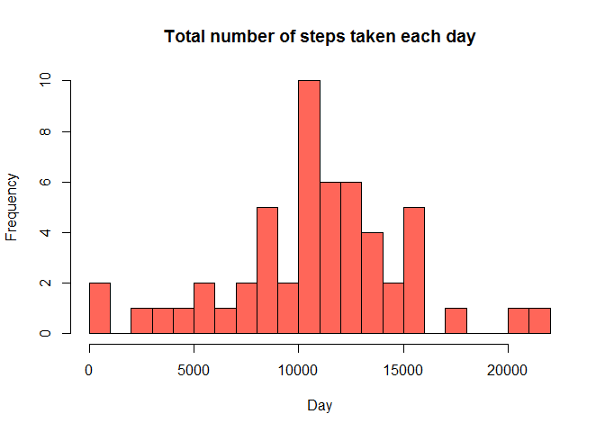
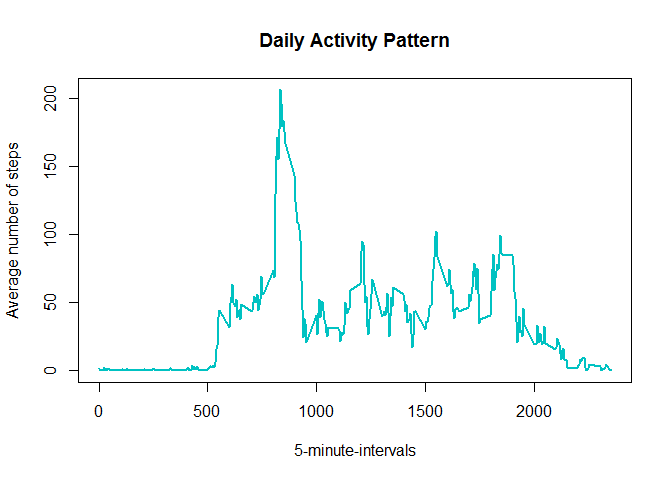
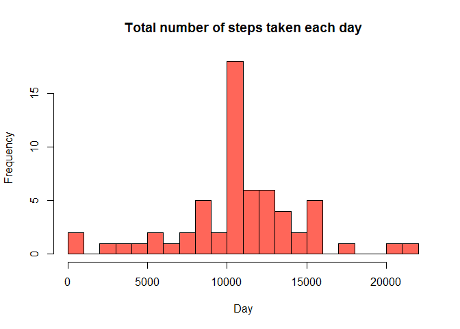
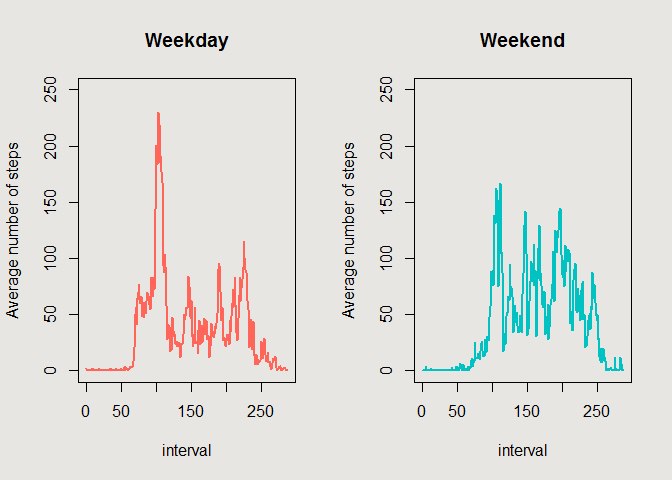

# Reproducible Research: Peer Assessment 1
## Introduction

This assignment makes use of data from a personal activity monitoring device. This device collects data at 5 minute intervals through out the day. The data consists of two months of data from an anonymous individual collected during the months of October and November, 2012 and include the number of steps taken in 5 minute intervals each day.

* **Datset**: https://d396qusza40orc.cloudfront.net/repdata%2Fdata%2Factivity.zip
* **Variables**:
	* *steps*: Number of steps taking in a 5-minute interval (missing values are coded as 𝙽𝙰)
	* *date*: The date on which the measurement was taken in YYYY-MM-DD format
	* *interval*: Identifier for the 5-minute interval in which measurement was taken
* **File format**: CSV
* **Observations**: 17,568


## Loading and preprocessing the data


```r
library(lubridate); library(dplyr)
```

```
## 
## Attaching package: 'dplyr'
```

```
## The following objects are masked from 'package:lubridate':
## 
##     intersect, setdiff, union
```

```
## The following objects are masked from 'package:stats':
## 
##     filter, lag
```

```
## The following objects are masked from 'package:base':
## 
##     intersect, setdiff, setequal, union
```

```r
data <- read.csv("activity.csv", header=TRUE, na.strings="NA",
                 colClasses=c("numeric", "character", "integer"))
data$date <- ymd(data$date)
```


## What is mean total number of steps taken per day?
The total number of steps taken each day is:

```r
data.rm <- data[!is.na(data$step),]
dailySteps <- tapply(data.rm$steps, data.rm$date, sum)
```

The historgram of the total number of steps taken each day is:

```r
hist(dailySteps, breaks=20, col="#FF6659",
     xlab="Day", ylab="Frequency",
     main="Total number of steps taken each day")
```



The mean and median of the total number of steps taken per day is:

```r
mean(dailySteps)
```

```
## [1] 10766.19
```

```r
median(dailySteps)
```

```
## [1] 10765
```


## What is the average daily activity pattern?
The time series plot of the 5-minute interval and the average number of steps taken, averaged across all days is:

```r
dailyAct <- tapply(data.rm$steps, data.rm$interval, mean)
plot(y=dailyAct, x=names(dailyAct), type="l", col="#00C2C2", lwd=2,
     xlab="5-minute-intervals", ylab="Average number of steps",
     main="Daily Activity Pattern")
```



On average across all the days in the dataset, the 5-minute interval that contains the maximum number of steps is:

```r
dailyAct[dailyAct==max(dailyAct)]
```

```
##      835 
## 206.1698
```


## Imputing missing values
There are a total of 2,304 missing values in the dataset:

```r
missing <- sum(is.na(data))
```

A strategy to address this is by using the average number of steps in the same 5-minute interval to fill in all the missing values in the dataset.
This results to the new dataset:

```r
meanIntervalSteps <- tapply(data$steps, data$interval, mean,
                            na.rm=TRUE, simplify=TRUE)
data.nw <- data
nas <- is.na(data.nw$steps)
data.nw$steps[nas] <- meanIntervalSteps[as.character(data.nw$interval[nas])]
sum(is.na(data.nw))
```

```
## [1] 0
```

The histogram of the total number of steps taken each day is:

```r
dailySteps.nw <- tapply(data.nw$steps, data.nw$date, sum)
hist(dailySteps.nw, breaks=20, col="#FF6659",
     xlab="Day", ylab="Frequency",
     main="Total number of steps taken each day")
```



The mean and median total number of steps taken during the day is:

```r
mean(dailySteps.nw)
```

```
## [1] 10766.19
```

```r
median(dailySteps.nw)
```

```
## [1] 10766.19
```

The impact of imputing the missing values in the dataset is that both the mean and median are now the same at 10,766.19.


## Are there differences in activity patterns between weekdays and weekends?
This creates a new factor variable in the data set with two levels - "weekday" and "weekend":

```r
data.wk <- data.nw
data.wk$dayType <- NA
for (i in 1:nrow(data.wk)) {
    if (weekdays(data.wk$date[i])=="Saturday" | 
        weekdays(data.wk$date[i])=="Sunday") {
        data.wk$dayType[i]<-"Weekend"
    }
    else {
        data.wk$dayType[i]<-"Weekday"
    }
}
```

This creates a panel plot containing the time series plot of the 5-minute interval and the average number of steps taken, averaged across all weekday days or weekend days:

```r
meanStepsWeekday <- tapply(data.wk[data.wk$dayType=="Weekday",]$steps, 
                           data.wk[data.wk$dayType=="Weekday",]$interval, mean,
                           na.rm=TRUE, simplify=TRUE)
meanStepsWeekend <- tapply(data.wk[data.wk$dayType=="Weekend",]$steps, 
                           data.wk[data.wk$dayType=="Weekend",]$interval, mean,
                           na.rm=TRUE, simplify=TRUE)
par(mfrow=c(1,2), bg="#E8E6E3", fg="#000000")
plot(meanStepsWeekday, col="#FF6659", type="l", lwd="2",
     xlab="interval", ylab="Average number of steps",
     main="Weekday", ylim=c(0,250))
plot(meanStepsWeekend, col="#00C2C2", type="l", lwd="2",
     xlab="interval", ylab="Average number of steps",
     main="Weekend", ylim=c(0,250))
```



The panel plot shows that the subject is more active early in the morning during weekdays, compared to weekends. However, for the remaining parts of the day, the subject is more active on weekends, compared to weekdays. This behavior may be attributable to the subject having work during weekdays. Thus, the subject may be concentrating more of his workouts in the morning right before work on weekdays, and distributing his workouts throughout the day during weekends. 
